# Flask and React vite with Login create Tasks
<p align="justify">
Flask REST API with sqlalchemy mysql where there is a login and register (you can change password and email, delete account) where each user can create titles and descriptions (you can edit and delete them) and in 'same' section the user can select the count of how many people have the same title he has created and see the emails of those people who have the same title.
</p>

<p align="center">
  
</p>

<p align="justify">
First create an account where you must create a username, password ("Must include at least one number.", "Must include at least one lowercase letter,"Must include at least one lowercase letter.", "Must include at least one uppercase letter.", "Must include at least one uppercase letter.","Must include at least one uppercase letter.", "Must include at least one uppercase letter.", "Must include at least one uppercase letter.","Must include at least one special character.", "Must include at least one special character.", "Must include at least one special character.","The length of the password must be equal to or greater than 8 characters.","Must not contain blank spaces.")  Confirm your password and enter an email address.
</p>

<p align="center">
  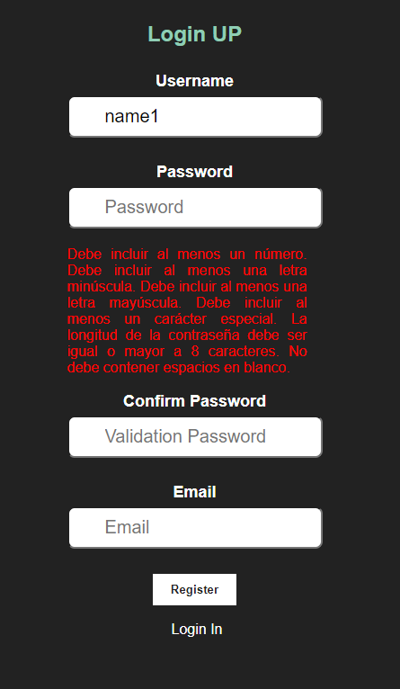
</p>

<p align="justify">
After entering the data correctly, click on the "Register" button.
</p>

<p align="center">
  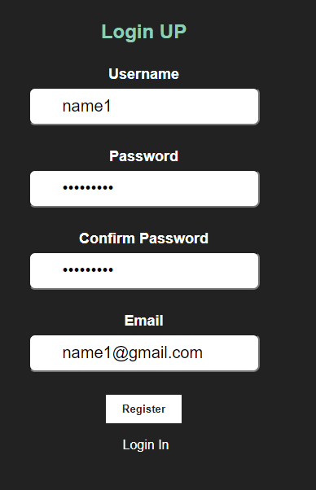
</p>


<p align="justify">
In login enter your username and password, click on the "Login" button.
</p>

<p align="center">
  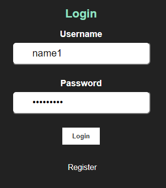
</p>


<p align="justify">
After logging in you will see the home screen where you will see your user name and registration id, in this section you can log out, change your password, delete your account (delete your account and tasks), and create a new task.
</p>

<p align="center">
  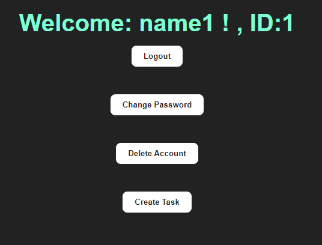
</p>

<p align="justify">
In change password you can change your password and email if required.
</p>

<p align="center">
  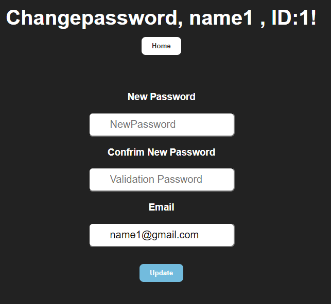
</p>

<p align="justify">
In task, you can create a title and a description of your choice, you can edit and delete it, and with the "home" button you go back to home and the "same" button to the same section.
</p>

<p align="center">
  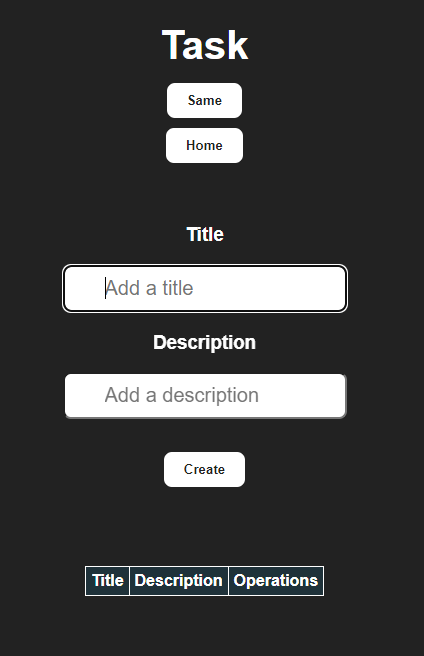
</p>

<p align="justify">
Once you have created your task you can edit it with the "Edit" button where you will see the title and description, you only have to modify it by clicking on the "Update" button. If you don't want to make the modification click on the "Cancel Edit" button.
</p>

<p align="center">
  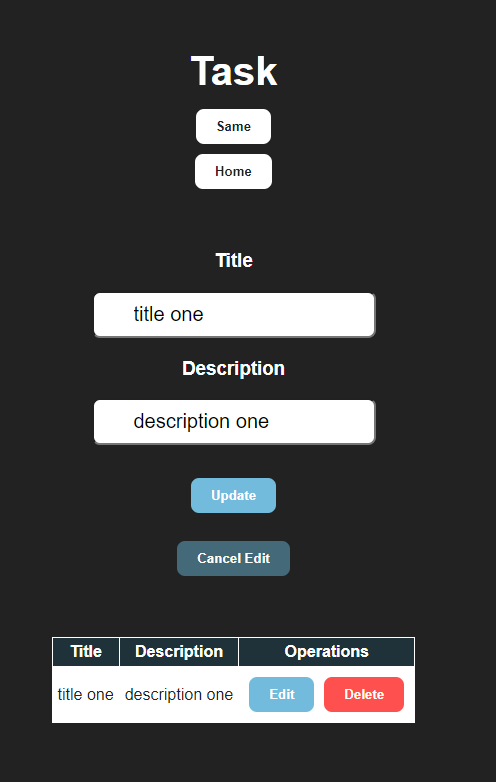
</p>
<p align="center">
  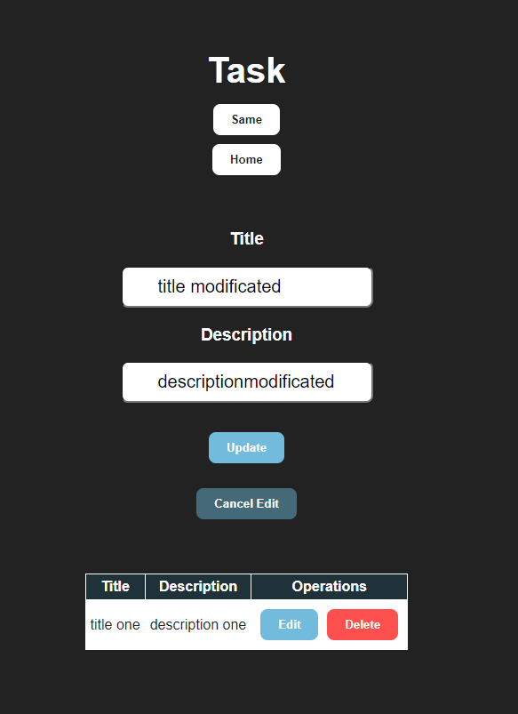
</p>
<p align="center">
  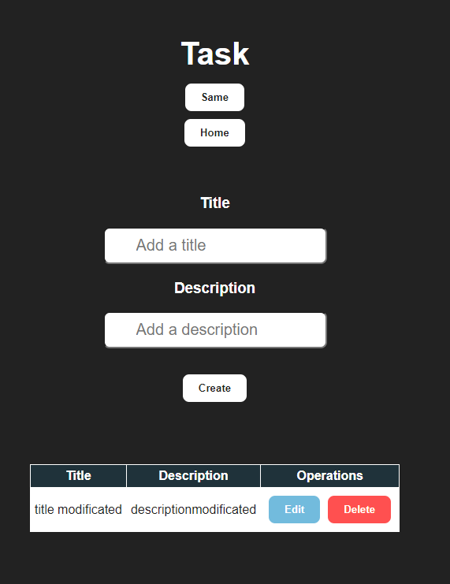
</p>

<p align="justify">
In this same section there are three buttons in which "Task" to return to Task, the button "Count People Same titile" once clicked counts how many users have the same title of the titles that the user has created in his account and these are shown in a table, the button "People Emails same title" once clicked shows the emails of the users that have the same title that the user has created in his account in a table form.
</p>

<p align="center">
  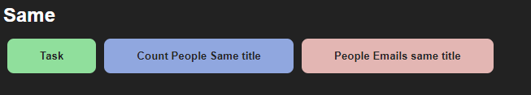
</p>

<p align="justify">
If there are no matching titles, a message will appear where it says: No title matches with other users.
</p>

<p align="center">
  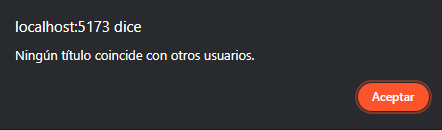
</p>

<p align="justify">
But if there are the same titles, the table of the selected button appears, in this case "Count People Same title":
</p>
<p align="center">
  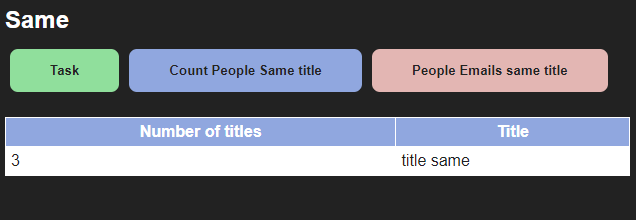
</p>

<p align="justify">
But if there are the same titles, the table of the selected button appears, in this case "People Emails same title":
</p>
<p align="center">
  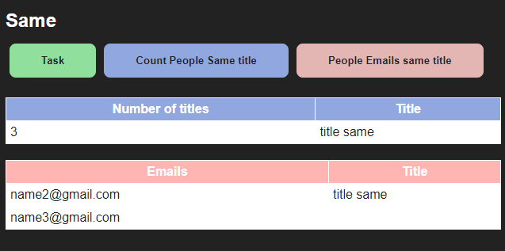
</p>


## Steps to implement it
Backend Options for do it: 

1. Use Dockerfile or docker-compose.yml
2. Use virtual enviroments and apply  requirements.txt 
```python
pip install -r requirements.txt
```
Use Docker 
```python
#Comands for use docker container mysql
docker run --name mymysql -e MYSQL_ROOT_PASSWORD=mypassword -p 3306:3306 -d mysql:latest

docker exec -it mymysql bash

#Inside of the container mysql
mysql -u root -p

create database flaskmysql;

```
Fronted React Options for do it:
1. Use Dockerfile or docker-compose.yml
2. Download dependencies and libraries
```python
#Download dependencies
 npm install 

#you can use the useRoutes function of the wouter library. Next I will show you how to configure and use wouter in a React application with Vite:

npm install wouter 


#const API_URL = import.meta.env.VITE_REACT_APP_API;
npm install dotenv
```
